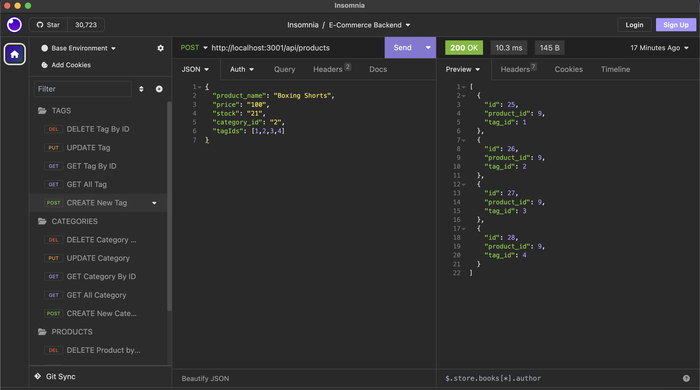

# BC13-E-commerce-Backend

## 🌏 Table of Contents:
- [Description](#description)
- [Installation](#installation)
- [Usage](#usage)
- [Video Walkthrough](#video-walkthrough)
- [Application UI](#application-user-interface)
- [Credits & Resources](#credits-and-resources)
- [Coded With](#coded-with)
- [Contributing](#contributing)
- [License](#license)

## Description:
* A simple E-commerce Backend application built using a working Express.js API, Sequelize and MySQL for CRUD operations.

#### User Story:
```md
AS A manager at an internet retail company
I WANT a back end for my e-commerce website that uses the latest technologies
SO THAT my company can compete with other e-commerce companies
```
#### Acceptance Criteria:
```md
GIVEN a functional Express.js API
WHEN I add my database name, MySQL username, and MySQL password to an environment variable file
THEN I am able to connect to a database using Sequelize
WHEN I enter schema and seed commands
THEN a development database is created and is seeded with test data
WHEN I enter the command to invoke the application
THEN my server is started and the Sequelize models are synced to the MySQL database
WHEN I open API GET routes in Insomnia Core for categories, products, or tags
THEN the data for each of these routes is displayed in a formatted JSON
WHEN I test API POST, PUT, and DELETE routes in Insomnia Core
THEN I am able to successfully create, update, and delete data in my database
```

## Installation:
* `git clone repository`
* `npm install`
* `mysql -u root -p`
* `source copy path schema`
* `npm run seed`

## Usage:
* To test routes, please install [Insomnia](https://insomnia.rest/) if you have not already.
* `http://localhost:3001` Use Port for Routes.
#### Tag Routes
* `GET /api/tags`: Get all Tag.
* `POST /api/tags`: Create new Tag.
* `GET /api/tags/:id`: Get Tag by ID.
* `PUT /api/tags/:id`: Update Tag by ID.
* `DELETE /api/tags/:id`: Delete Tag by ID.

#### Category Routes
* `GET /api/categories`: Get all Category.
* `POST /api/categories`: Create new Category.
* `GET /api/categories/:id`: Get Category by ID.
* `PUT /api/categories/:id`: Update Category by ID.
* `DELETE /api/categories/:id`: Delete Category by ID.

#### Product Routes
* `GET /api/products`: Get all Product.
* `POST /api/products`: Create new Product.
* `GET /api/products/:id`: Get Product by ID.
* `PUT /api/products/:id`: Update Product by ID.
* `DELETE /api/products/:id`: Delete Product by ID.

## Video Walkthrough:
* 🎥 [Video Walkthrough: E-commerce Backend.](https://www.youtube.com/watch?v=sTckPLQBA3w)

## Application User Interface:


## Credits and Resources:
* Google search & Youtube videos.
* ChatGpt for troubleshooting.
* Mini project 13: EdX & UCB.
* Starter code EdX & UCB.
* Stack Overflow & MDN.

## Coded With:
* Sequelize.
* Nodemon.
* Express.
* MySQL2.
* Dotenv.
* Node.js.
* VS Code.
* Youtube.

## Contributing:
* Any ideas or feedback is very much appreciated.

## License:
[](https://opensource.org/licenses/MIT)